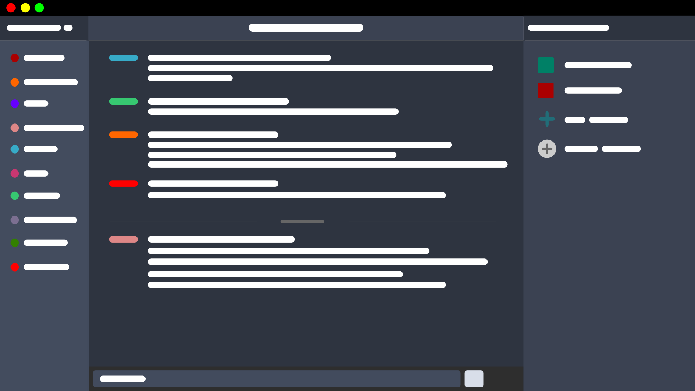
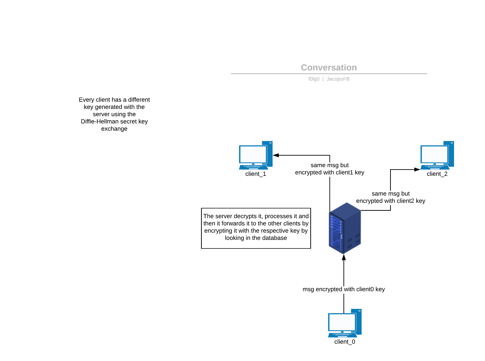

# <app_name>
A simple, anonymous and fully encrypted chat application built using sockets in Python3



# About

<app_name> is a simple chat application written using sockets. Clients connect to a server which lets them send text messages to each other.

Messages are custom crafted packets built using Python3 dataclasses, we stream them usign JSON due to the fact that Pickle is vulnerable to code injection. These messages are also encrypted using AES-256 to ensure privacy and anonymity to the users. We don't collect any kind of user data.

Key exchange is performed using DiffieHellman and the GUI is built using the pip library "Eel". This means that the entire user experience is coded from scratch with JS, HTML and CSS.

# Conversations



Every client has its own private key shared only with the server. The server will care about encrypting and decrypting with the respective key for the other clients. 

Here's a more detailed example.


# Technical details

As metioned in the "About" section, messages are custom dataclasses objects streamed in the universal standard JSON format. They are carefully streamed with a small buffer size thanks to the fact that every packet is preceded by a fixed length header containing information about the actual packet size.

We use AES-256 to ensure privacy to our users, we also automate the key exchange process so clients don't have to know any password.  
As stated before, key exchange is performed with a classic DiffieHellman exchange based on very large integers.

# Anonymousity

To start using <app_name> you don't need any kind of account. Your precious personal data remains in your head, everything here is anonymous. You just need to care about your IP address, using a VPN is a good idea (everywhere in the internet!). 

# Requirements 

* Python 3.x
* socket
* json
* threading
* sys
* datetime
* time
* argparse
* dataclasses_json
* pycryptodome
* pyDHE
* Eel

# Run 

### 1st option:

```
python3 server.py -p <port number>
```
```
python3 client.py -s <server_ip> -p <server_port>
```

### 2nd option:

```
python3 server.py
```
```
python3 client.py
```

Everybody has the ability to start their own server, this is the key aspect of this application. You don't depend on third parties, you are your own service provider. Server can even be started on a Raspberry Pi, you don't need power. Everything is lightweight, especially server side. 

## Features

* [export_chat] > export current chat to a text file 
* [help] > display all possible commands

## Thank you!

Thank you for using our application! We would love to hear feedback and we are open to any kind of questions!

## Authors

[f0lg0](https://github.com/f0lg0)

[JacopoFB](https://github.com/JacopoFB)

## Contact

Open an issue here or:

[f0lg0 Twitter](https://twitter.com/f0lg0)
[f0lg0 Reddit](https://www.reddit.com/user/_folgo_/)


