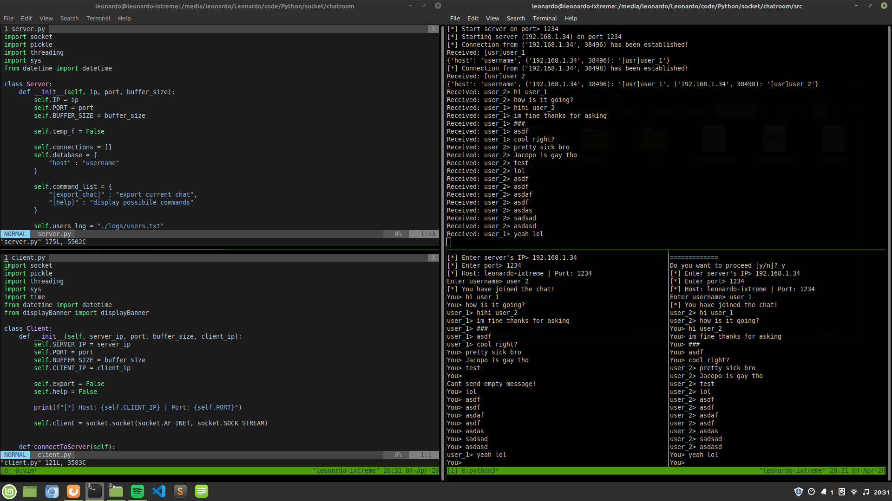

# <app_name>
A simple, secure and fully encrypted chat application built using sockets in Python3



# About

<app_name> is a simple chat application written using sockets. Clients connect to a server which lets them send text messages to each other.

Messages are custom crafted packets built using Python3 dataclasses, we stream them usign JSON due to the fact that Pickle is vulnerable to code injection. These messages are also encrypted
using AES-256 to ensure privacy and anonymity to the users. We don't collect any kind of user data.

This was initially developed under a Linux system so it may have issues under Windows. Currently we are working 
on porting it to Windows. 

# Requirements 

* Python 3.x
* socket
* json
* threading
* sys
* datetime
* time
* argparse
* dataclasses_json
* pycryptodome

# Run 

### 1st option:

```
python3 server.py -p <port number>
```
```
python3 client.py -s <server_ip> -p <server_port>
```

### 2nd option:

```
python3 server.py
```
```
python3 client.py
```

## Features

* [export_chat] > export current chat to a text file 
* [help] > display all possible commands

## Authors

[f0lg0](https://github.com/f0lg0)

[JacopoFB](https://github.com/JacopoFB)


